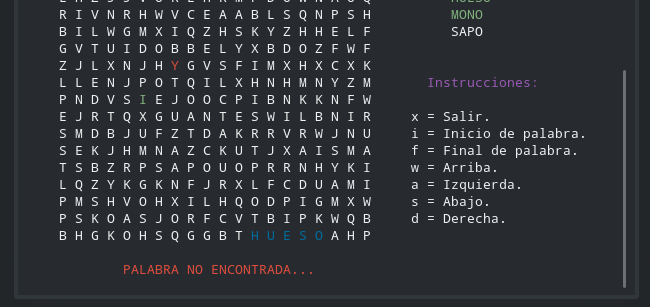

## Sopa de Letras

Este es un pequeño proyecto desarrollado en lenguaje python en su versión 3.7, originalmente el proyecto debía ser desarrollado en lenguaje C, sin embargo esta es una versión académica personal para el aprendizaje de este lenguaje (python). El juego es completamente funcional y consiste en buscar 5 palabras seleccionadas aleatoriamente por la aplicación en una mítica sopa de letras. Cabe mencionar que la palabras pueden encontrarse en todos los sentidos de los puntos cardinales y también intersectarse si coinciden las letras.

Para probar el juego, se debe ejecutar el archivo ***main.py*** dentro del directorio Código, una vez ejecutado, podemos observar que la aplicación cuenta con un menú de usuario:

 

En el cual podemos encontrar algunas opciones básicas como el listado de palabras disponibles para jugar, la opción de iniciar una partida nueva y del mismo modo continuar con una partida. Cabe destacar que para continuar una partida, se debe antes iniciar una partida nueva.

**NOTA: Si la consola se cierra, la partida no queda guardada**

Si iniciamos una nueva partida, nos mostrará la siguiente pantalla:

 

En la cual tenemos unas breves instrucciones sobre los controles y la manera en como seleccionar la palabra. Podemos observar que las palabras en el tablero que se marcan en azul son las palabras que se han descubierto hasta el momento, del mismo modo, se marcan en verde en la lista de la izquierda, el color rojo en el tablero indica la posición actual del jugador y el color verde indica que esa letra se marcó como "inicio de palabra" **(letra i)**, si al momento de pulsar la tecla "final de palabra" **(letra f)** la palabra coincide con alguna de la lista (que no haya sido descubierta) automáticamente la palabra se marcará de azul en el tablero y de verde en la lista, en caso de que no sea una palabra correcta, recibirás un pequeño aviso en la parte inferior del tablero:

 

El juego termina cuando el jugador consiga las 5 palabras, sin embargo, nunca es tarde para una partida nueva!!

### Desarrollador
* [David Chacón (@DavidL28D)](https://github.com/DavidL28D)

